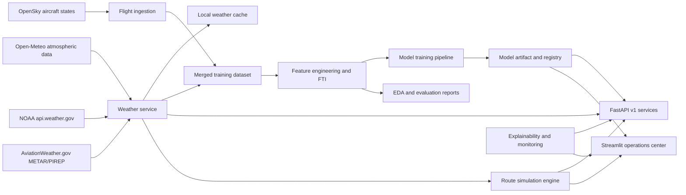

# FTIS Architecture

## Layers

- Data ingestion: `scripts/fetch_flights.py`, `scripts/fetch_weather.py`
- Live weather: `ftis/weather/`
- Route analysis: `ftis/routes/`
- Dataset preparation: `scripts/preprocess_data.py`
- Feature engineering: `scripts/feature_engineering.py`, `ftis/features.py`
- Modeling: `scripts/train_model.py`, `scripts/evaluate_model.py`, `ftis/modeling.py`
- Explainability and monitoring: `ftis/explain_model.py`, `ftis/model_monitoring.py`
- Inference/API: `api/main.py`, `ftis/inference.py`
- Decision support UI: `dashboard/app.py`
- Deployment: `Dockerfile`, `docker-compose.yml`, `.github/workflows/ci.yml`
