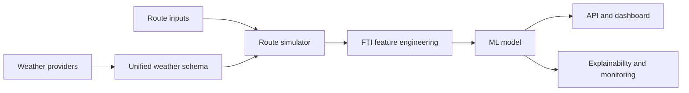

# Flight Turbulence Intelligence System: A Production-Oriented Aviation AI Platform

## Abstract

Flight Turbulence Intelligence System (FTIS) is an aviation AI platform for route-level turbulence awareness. The system combines live weather providers, transparent feature engineering, supervised machine learning, and operational visualization to estimate a Flight Turbulence Index (FTI) from 0 to 100. This draft describes the architecture, FTI formulation, model workflow, route simulation engine, and deployment strategy for research and portfolio evaluation.

## Motivation

Turbulence affects passenger safety, crew workload, fuel planning, routing efficiency, and operational predictability. A practical turbulence intelligence platform must combine atmospheric state, aircraft context, model confidence, and route-level visualization. FTIS treats turbulence prediction as a decision-support problem rather than only a point classifier.

## System Architecture

FTIS uses a reusable `ftis/` package for features, inference, weather normalization, route simulation, monitoring, and model registry operations. FastAPI exposes prediction, route, weather, model, and system endpoints. Streamlit provides a dispatch-oriented operations center.



## Flight Turbulence Index

FTI is a transparent score designed for operational interpretability:

```text
FTI = 0.55 * turbulence_intensity
    + 0.35 * atmospheric_instability
    + 0.10 * wind_component
```

The turbulence intensity and instability components are derived from wind speed, wind shear, pressure variation, temperature gradient, and vertical motion proxies. Scores below 33 are Low, 33 to 66 are Moderate, and above 66 are High.

## Model Workflow

The training pipeline compares baseline, Random Forest, and XGBoost candidates using weighted F1, precision, recall, confusion matrices, and classification reports. The selected artifact stores preprocessing, model, label encoder, feature columns, metadata, and comparison metrics.

## Route Simulation

The route engine resolves departure/destination airports, interpolates great-circle waypoints, generates climb-cruise-descent altitude profiles, samples weather along the route, predicts risk at each waypoint, and detects contiguous turbulence corridors. Outputs include JSON, GeoJSON, CSV, dashboard overlays, cumulative FTI, max FTI, estimated time, and route-level risk.

## Operational Workflow

1. Dispatch enters departure, destination, altitude, speed, and waypoint density.
2. FTIS samples live or fallback weather along the route.
3. The model produces per-waypoint risk, confidence, and FTI.
4. The dashboard highlights corridors and provides operational alerts.
5. Monitoring endpoints expose model metrics, cache health, provider status, and feature importance.

## Scalability Discussion

The current implementation is suitable for local demos and cloud containers. Future production scaling should move weather ingestion into scheduled jobs, store route samples in a geospatial database, introduce vector-tile serving, and validate predictions against PIREP, EDR, AMDAR, and radar-derived turbulence products.
